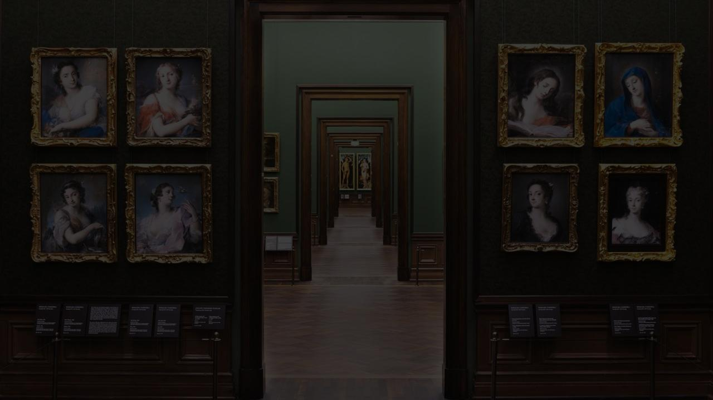

# Yadawity - Art Gallery & Auction Platform



## 🎨 About Yadawity

Yadawity is a comprehensive digital art platform that connects artists, buyers, and art enthusiasts. The platform features both local and virtual gallery experiences, art auctions, art therapy sessions, and educational workshops.

## ✨ Features

### 🖼️ Gallery Experience
- **Local Galleries**: Physical gallery visits with in-person tours and live events
- **Virtual Galleries**: Immersive VR tours and global art exhibitions
- **Artist Portfolios**: Detailed artist profiles with achievements and reviews

### 🔨 Auction System
- **Live Auctions**: Real-time bidding system with countdown timers
- **Auction Preview**: Detailed artwork information and bidding history
- **Status Management**: Active, upcoming, and ended auction tracking

### 🛒 E-commerce Features
- **Shopping Cart**: Add artworks to cart with quantity management
- **Wishlist**: Save favorite artworks for later
- **Order Management**: Track purchases and order history
- **Secure Checkout**: Safe payment processing

### 👨‍🎨 Artist Portal
- **Profile Management**: Artist dashboard with photo uploads
- **Artwork Management**: Upload and manage artwork portfolios
- **Achievement System**: Track and display artist accomplishments
- **Review System**: Customer feedback and ratings

### 🧘 Art Therapy & Workshops
- **Therapy Sessions**: Art therapy booking and management
- **Educational Workshops**: Learning opportunities for all skill levels
- **Session Management**: Flexible scheduling system

### 👥 User Management
- **Multi-role System**: Artists, buyers, administrators
- **Authentication**: Secure login/registration
- **Profile Customization**: Personal profiles with photo uploads
- **Account Management**: Email/password changes, account deletion

## 🏗️ Technical Architecture

### Frontend Technologies
- **HTML5**: Semantic markup structure
- **CSS3**: Modern styling with custom properties and animations
- **JavaScript ES6+**: Modern JavaScript with classes and modules
- **Font Awesome**: Icon library
- **SweetAlert2**: Enhanced user notifications

### Backend Technologies
- **PHP**: Server-side logic and API endpoints
- **MySQL**: Database management
- **Session Management**: Secure user authentication
- **File Upload**: Image and document handling

### Key Components
- **Responsive Navbar**: Desktop and mobile navigation
- **Burger Menu**: Mobile-optimized side navigation
- **Modal System**: Interactive popups and forms
- **Real-time Updates**: Live cart and wishlist counters
- **Image Management**: Photo upload and optimization

## 📁 Project Structure

```
yadawity/
├── index.php                 # Homepage
├── gallery.php              # Gallery hub
├── auction.php              # Auction listings
├── localGallery.php         # Local gallery experience
├── virtualGallery.php       # Virtual gallery tours
├── artistPortal.php         # Artist dashboard
├── profile.php              # User profile management
├── cart.php                 # Shopping cart
├── checkout.php             # Payment processing
├── login.php                # Authentication
├── signup.php               # User registration
│
├── components/              # Reusable UI components
│   ├── Navbar/
│   │   ├── navbar.php
│   │   ├── navbar.css
│   │   └── navbar.js
│   ├── BurgerMenu/
│   │   ├── burger-menu.php
│   │   ├── burger-menu.css
│   │   └── burger-menu.js
│   └── includes/
│       ├── navbar.php
│       ├── burger-menu.php
│       └── footer.php
│
├── API/                     # Backend API endpoints
│   ├── db.php              # Database configuration
│   ├── checkCredentials.php # Authentication
│   ├── getAllArtworks.php  # Artwork retrieval
│   ├── getAllAuction.php   # Auction data
│   ├── getCart.php         # Cart management
│   ├── getWishlist.php     # Wishlist operations
│   ├── addToCart.php       # Cart additions
│   ├── addArtwork.php      # Artwork uploads
│   └── [more API files...]
│
├── public/                  # Frontend assets
│   ├── homePage.css
│   ├── gallery.css
│   ├── auction.css
│   ├── cart.js
│   ├── auction.js
│   └── gallery.js
│
├── admin-system/           # Administrative interface
│   ├── dashboard.php
│   ├── users.php
│   ├── artworks.php
│   ├── auctions.php
│   └── analytics.php
│
├── image/                  # Static images
├── uploads/               # User uploaded content
└── app.js                # Main application logic
```

## 🚀 Installation & Setup

### Prerequisites
- **XAMPP** (Apache, MySQL, PHP)
- **Web Browser** (Chrome, Firefox, Safari)
- **Text Editor** (VS Code recommended)

### Installation Steps

1. **Clone or Download**
   ```bash
   # Place files in XAMPP htdocs directory
   /Applications/XAMPP/xamppfiles/htdocs/yadawity/
   ```

2. **Database Setup**
   - Start XAMPP (Apache + MySQL)
   - Access phpMyAdmin: `http://localhost/phpmyadmin`
   - Create database: `yadawity_db`
   - Import database schema (if available)

3. **Configuration**
   - Update database credentials in `API/db.php`
   - Configure file upload paths
   - Set proper folder permissions for `uploads/`

4. **Access Application**
   ```
   http://localhost/yadawity/
   ```

## 🔧 Configuration

### Database Configuration (`API/db.php`)
```php
<?php
$host = 'localhost';
$username = 'root';
$password = '';
$database = 'yadawity_db';
?>
```

### File Upload Settings
- Maximum file size: 10MB
- Allowed formats: JPG, PNG, GIF
- Upload directory: `uploads/`

## 🎯 User Roles & Permissions

### 👤 Visitor/Guest
- Browse galleries and artworks
- View auction listings
- Access public content

### 🛒 Buyer
- All visitor permissions
- Add items to cart/wishlist
- Make purchases
- Participate in auctions
- Leave reviews

### 🎨 Artist
- All buyer permissions
- Upload artwork portfolios
- Manage artist profile
- View sales analytics
- Respond to reviews

### 👨‍💼 Administrator
- All permissions
- User management
- Content moderation
- System analytics
- Auction management

## 🔐 Security Features

- **Input Validation**: Server-side validation for all forms
- **SQL Injection Protection**: Prepared statements
- **File Upload Security**: Type and size validation
- **Session Management**: Secure user sessions
- **Password Hashing**: Encrypted password storage
- **CSRF Protection**: Form token validation

## 📱 Responsive Design

The platform is fully responsive and optimized for:
- **Desktop**: Full-featured experience
- **Tablet**: Touch-optimized interface
- **Mobile**: Burger menu navigation
- **All Screen Sizes**: Flexible layouts

## 🧪 Testing

### Manual Testing
- User registration/login flows
- Cart and wishlist functionality
- Auction bidding system
- File upload features
- Payment processing

### Browser Compatibility
- Chrome (recommended)
- Firefox
- Safari
- Edge

## 🚀 Deployment

### Production Checklist
- [ ] Update database credentials
- [ ] Enable error logging
- [ ] Configure SSL certificates
- [ ] Set up backup systems
- [ ] Optimize images and assets
- [ ] Configure CDN (if applicable)

### Performance Optimization
- Image compression
- CSS/JS minification
- Database query optimization
- Caching implementation
- CDN integration

## 🔄 API Endpoints

### Authentication
- `POST /API/checkCredentials.php` - Login verification
- `POST /API/forgetPassword.php` - Password reset

### Artworks
- `GET /API/getAllArtworks.php` - Retrieve artworks
- `POST /API/addArtwork.php` - Upload artwork
- `DELETE /API/deleteArtwork.php` - Remove artwork

### Auctions
- `GET /API/getAllAuction.php` - Get auction listings
- `POST /API/addAuction.php` - Create auction
- `GET /API/getAuctionInfo.php` - Auction details

### Cart & Wishlist
- `GET /API/getCart.php` - Get cart items
- `POST /API/addToCart.php` - Add to cart
- `GET /API/getWishlist.php` - Get wishlist
- `POST /API/addToWishlist.php` - Add to wishlist

## 🐛 Troubleshooting

### Common Issues

**Database Connection Error**
- Check XAMPP MySQL service
- Verify database credentials
- Ensure database exists

**File Upload Issues**
- Check folder permissions
- Verify file size limits
- Confirm allowed file types

**JavaScript Errors**
- Check browser console
- Verify file paths
- Ensure dependencies loaded

**Session Issues**
- Clear browser cookies
- Check PHP session configuration
- Verify server permissions

## 🤝 Contributing

### Development Guidelines
1. Follow existing code structure
2. Use semantic HTML5
3. Maintain responsive design
4. Add appropriate comments
5. Test across browsers

### Code Style
- **PHP**: PSR-12 coding standard
- **JavaScript**: ES6+ with consistent formatting
- **CSS**: BEM methodology recommended
- **HTML**: Semantic markup

## 📞 Support

For technical support or questions:
- **Email**: support@yadawity.com
- **Documentation**: Check inline code comments
- **Issues**: Review troubleshooting section

## 📄 License

This project is proprietary software. All rights reserved.

## 🔄 Version History

### v1.0.0 (Current)
- Initial release
- Core gallery functionality
- Auction system
- User management
- Art therapy features

---

**Yadawity** - Connecting Art, Artists, and Art Lovers 🎨

*Last Updated: August 31, 2025*
